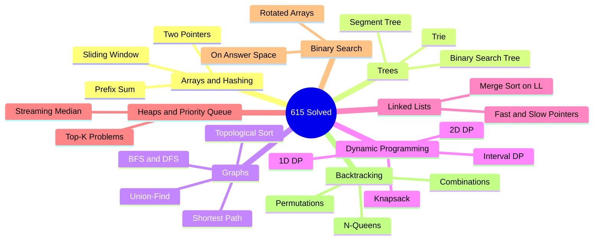
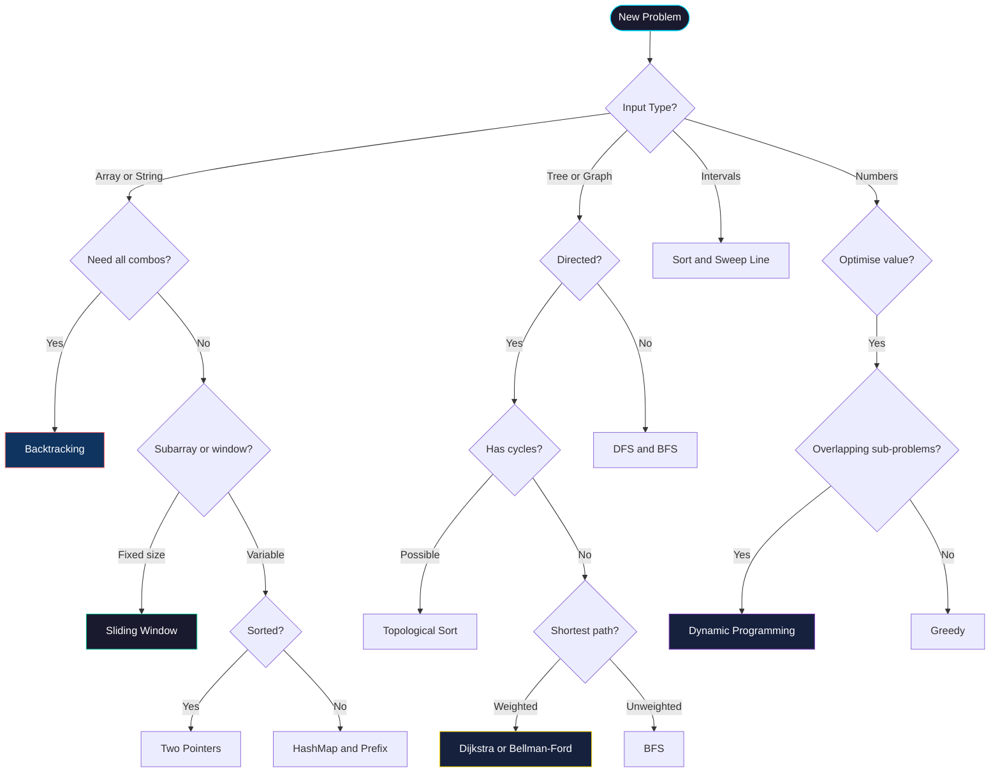
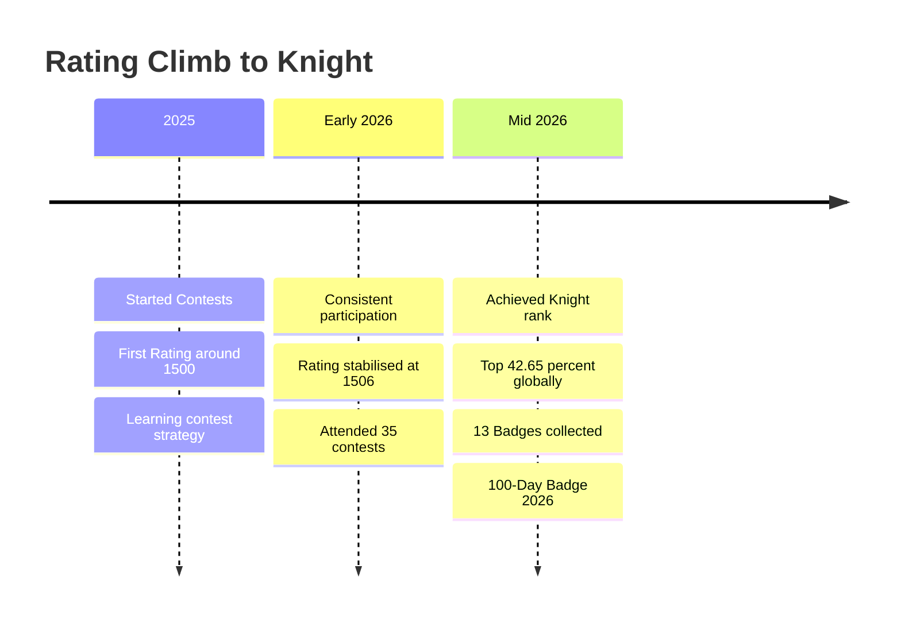
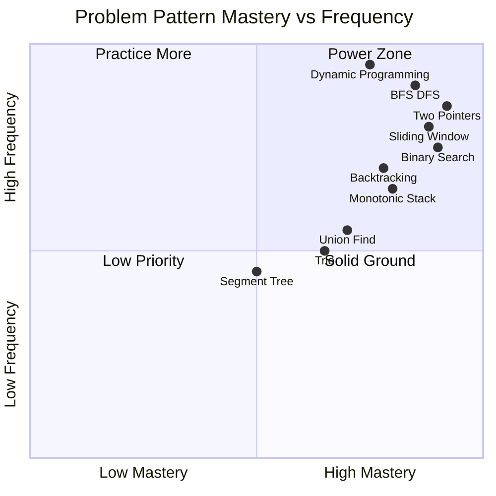
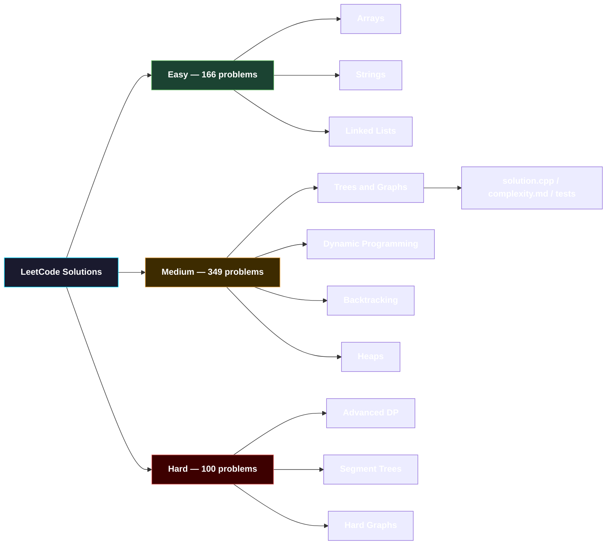

<div align="center">


<a href="https://git.io/typing-svg">
  
</a>

<br/>

<p>
  <a href="https://leetcode.com/u/adarsh__singh_/">
    
  </a>
  
  
  
</p>

<p>
  
  
  
  
</p>

</div>

---

<table>
<tr>
<td width="50%" valign="top">

## 🧠 About This Arsenal

> *"The art of programming is the art of organizing complexity."*
> — Edsger W. Dijkstra

This repository is a curated **battle log** of algorithmic problems solved with precision — optimised for **time complexity**, **space efficiency**, and **clean code**.

- 🎯 **Goal**: Master every pattern, every paradigm
- 🔥 **Languages**: C++, Rust, Go, Python, TypeScript
- 🏗️ **Focus**: Distributed systems patterns in solutions
- 🧩 **Style**: Annotated with complexity proofs

</td>
<td width="50%" valign="top">

## ⚙️ Tech Stack

```
┌─────────────────────────────────────┐
│  Primary    →  C++ (STL mastery)    │
│  Systems    →  Rust (zero-cost)     │
│  Scripting  →  Python (prototyping) │
│  Concurrent →  Go (goroutines)      │
│  Web/DSA    →  TypeScript           │
└─────────────────────────────────────┘
```

| Language   | Problems | Specialty            |
|-----------|----------|----------------------|
| C++        | 400+     | Speed-critical       |
| Python     | 100+     | DP / Graph           |
| Rust       | 60+      | Memory safety        |
| Go         | 40+      | Concurrency patterns |
| TypeScript | 15+      | Interview prep       |

</td>
</tr>
</table>

---

<div align="center">

## 📊 Live LeetCode Dashboard

[](https://leetcode.com/u/adarsh__singh_/)

<br/>

<a href="https://leetcode.com/u/adarsh__singh_/">
  
</a>

</div>

---

## 🗺️ Problem Universe — Category Map



---

## 🔀 Algorithm Selection Framework

> *The mental model I use when approaching any new problem*



---

## 🏆 Contest Journey



---

## 🧩 Pattern Mastery Board



---

## 📁 Repository Architecture



---

## 🌟 Flagship Solutions

<details>
<summary>🔴 Hard Problems — Click to Expand</summary>

<br/>

| # | Problem | Pattern | Complexity | Solution |
|---|---------|---------|------------|---------|
| 23 | [Merge K Sorted Lists](https://leetcode.com/problems/merge-k-sorted-lists/) | Priority Queue | O(N log K) / O(K) | [View →](./Hard/23-merge-k-sorted-lists/) |
| 42 | [Trapping Rain Water](https://leetcode.com/problems/trapping-rain-water/) | Two Pointers | O(N) / O(1) | [View →](./Hard/42-trapping-rain-water/) |
| 76 | [Minimum Window Substring](https://leetcode.com/problems/minimum-window-substring/) | Sliding Window | O(N) / O(K) | [View →](./Hard/76-minimum-window-substring/) |
| 84 | [Largest Rectangle in Histogram](https://leetcode.com/problems/largest-rectangle-in-histogram/) | Monotonic Stack | O(N) / O(N) | [View →](./Hard/84-largest-rectangle/) |
| 124 | [Binary Tree Max Path Sum](https://leetcode.com/problems/binary-tree-maximum-path-sum/) | Tree DFS | O(N) / O(H) | [View →](./Hard/124-max-path-sum/) |
| 295 | [Find Median from Data Stream](https://leetcode.com/problems/find-median-from-data-stream/) | Two Heaps | O(log N) / O(N) | [View →](./Hard/295-median-stream/) |
| 297 | [Serialize / Deserialize BST](https://leetcode.com/problems/serialize-and-deserialize-binary-tree/) | BFS / DFS | O(N) / O(N) | [View →](./Hard/297-serialize-bst/) |
| 329 | [Longest Increasing Path in Matrix](https://leetcode.com/problems/longest-increasing-path-in-a-matrix/) | DFS + Memo | O(MN) / O(MN) | [View →](./Hard/329-lip-matrix/) |

</details>

<details>
<summary>🟡 Medium — Favourite Patterns</summary>

<br/>

| # | Problem | Pattern | Complexity | Solution |
|---|---------|---------|------------|---------|
| 11 | [Container With Most Water](https://leetcode.com/problems/container-with-most-water/) | Two Pointers | O(N) / O(1) | [View →](./Medium/11-container-water/) |
| 15 | [3Sum](https://leetcode.com/problems/3sum/) | Sort + Two Ptr | O(N²) / O(1) | [View →](./Medium/15-three-sum/) |
| 48 | [Rotate Image](https://leetcode.com/problems/rotate-image/) | Matrix Math | O(N²) / O(1) | [View →](./Medium/48-rotate-image/) |
| 56 | [Merge Intervals](https://leetcode.com/problems/merge-intervals/) | Sort + Sweep | O(N log N) / O(N) | [View →](./Medium/56-merge-intervals/) |
| 128 | [Longest Consecutive Sequence](https://leetcode.com/problems/longest-consecutive-sequence/) | HashSet | O(N) / O(N) | [View →](./Medium/128-longest-consecutive/) |
| 207 | [Course Schedule](https://leetcode.com/problems/course-schedule/) | Topo Sort | O(V+E) / O(V+E) | [View →](./Medium/207-course-schedule/) |
| 322 | [Coin Change](https://leetcode.com/problems/coin-change/) | DP (Bottom-Up) | O(A·N) / O(A) | [View →](./Medium/322-coin-change/) |
| 416 | [Partition Equal Subset Sum](https://leetcode.com/problems/partition-equal-subset-sum/) | 0/1 Knapsack | O(N·S) / O(S) | [View →](./Medium/416-partition-subset/) |

</details>

---

## 📋 Solution File Convention

Every solution follows this **annotated template**:

```cpp
/**
 * ╔══════════════════════════════════════════════════════╗
 * ║  LeetCode #[ID] — [Problem Title]                    ║
 * ║  Difficulty: [Easy | Medium | Hard]                  ║
 * ║  Pattern:    [Pattern Name]                          ║
 * ╚══════════════════════════════════════════════════════╝
 *
 * INTUITION:
 *   [2-3 sentences explaining the core insight]
 *
 * APPROACH:
 *   1. [Step one]
 *   2. [Step two]
 *   3. [Step three]
 *
 * COMPLEXITY:
 *   Time  → O(...)   Reason: [brief justification]
 *   Space → O(...)   Reason: [brief justification]
 *
 * EDGE CASES HANDLED:
 *   - [Empty input]
 *   - [Single element]
 *   - [Overflow cases]
 */
class Solution {
public:
    // ── your clean, readable solution here ──
};
```

---

## 🔗 Connect & Resources

<div align="center">

| Platform | Link | What You'll Find |
|---------|------|-----------------|
| 🟠 LeetCode | [adarsh__singh_](https://leetcode.com/u/adarsh__singh_/) | All contest & problem submissions |
| 💼 LinkedIn | [adarsh-singh-7683612a4](https://linkedin.com/in/adarsh-singh-7683612a4) | Professional journey |
| 🌐 Portfolio | [portfolio-mu-black-19.vercel.app](https://portfolio-mu-black-19.vercel.app) | Projects & writeups |

</div>

<br/>

> 💡 **Study Roadmap**: If you're starting out, follow the [Neetcode 150](https://neetcode.io/roadmap) → then [Blind 75](https://leetcode.com/discuss/general-discussion/460599/) → then contest problems.

---

<div align="center">


<br/><br/>


<br/>


</div>
